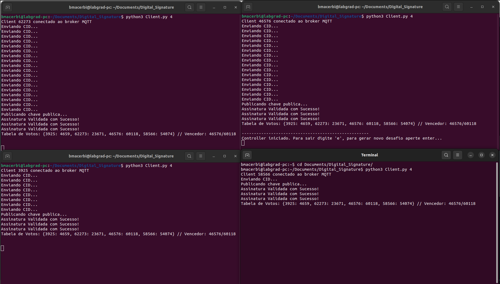
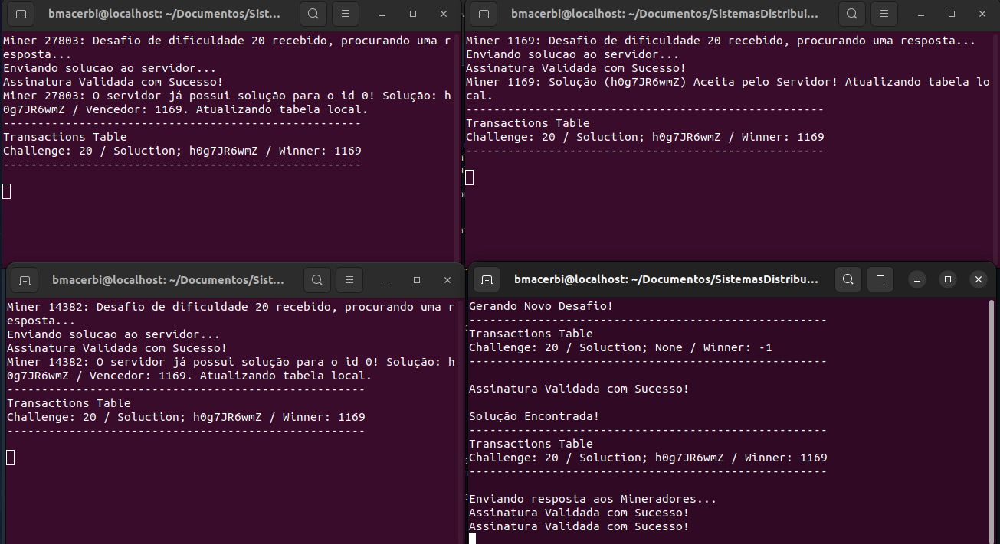

# Laboratório #7 -- Assinaturas Digitais
## Integrantes: Bruno Menegaz, Gustavo Dutra, Leonardo Albergaria
---
## **Instruções para Compilação e Execução**

### **Inicializando Ambiente**

Para realizar a instalação, o primeiro passo é clonar o repositório para um diretório local e instalar o python em conjunto das bibliotecas utilizadas. Para realizar o download de todas as dependências, basta utilizando o seguinte comando:

```
$ pip3 install -r requirements.txt
```

Em sequência, caso o interesse seje rodar com um broker local, tal como aplicação foi desenvolvida, é necessário realizar a inicialização do broker MQTT a partir do docker. Para isso deve-se executar a linha de comando linux:

```
$ sudo docker-compose up -d
```

### **Execução**

Para efetuar a execução do projeto, basta realizar uma chamada python para o arquivo **Client.py** informando a quantidade de clientes a serem suportados no sistema. Vale destacar que essa chamada deve ser feita para os *N* clientes diferentes, cada um com o seu terminal dedicado, ou seja, serão *N* terminais distintos chamando a seguinte linha de comando em linux.

```
$ python3 Client.py N_CLIENTS
```

---
## **Link para o vídeo no Youtube**

> https://youtu.be/qpwoUgGtQbQ

---
## **Implementação**

Para apresentarmos a nossa aplicação iremos passar por cada arquivo desenvolvido dando uma ideia geral das suas funcionalidades.

### **Client.py**

Define a classe Client. Cada client possui algumas variáveis importantes, como seu **ID** (um inteiro aleatório de [0, 65335]), uma lista de clientes conectados, a tabela de votos, o **ID** do controlador, seu par de chaves pública/privada, etc.

Os métodos **_on_connect_** e **_on_message_** são chamados quando o cliente se conecta ao broker **MQTT** e quando recebe uma mensagem, respectivamente. Ao se conectar, um cliente se inscreve nos tópicos **"sd/init"**, **"sd/ElectionMsg"** e **"sd/pubkey"**. Ao receber uma mensagem, caso seja do tópico **init**, o cliente atualiza a lista de clientes conectados, e caso o mínimo de clientes já estejam conectados, inicia-se a publicação das chaves públicas de cada cliente. Caso haja um recebimento da mensagem de **pubkey**, o cliente armazena a respectiva chave com o id do cliente que a enviou em um dicionario local. Por fim, caso a mensagem recebida seja do tópico **ElectionMsg**, o cliente verifica se a assinatura dessa mensagem é válida baseando-se na chave pública do cliente em questão, caso a validação seja efetuada, atualiza-se a tabela de votos com o voto recebido.

O método **vote** é usado para gerar um voto aleatório e publicá-lo no tópico **"sd/ElectionMsg"**, onde o voto é um inteiro aletório do intervalo [0, 65335]. Em conjunto ao voto, também é publicado nessa mensagem a assinatura dessa mensagem realizada a partir da chave privada do cliente em questão.

Já o método **setWinner** contabiliza os votos recebidos, determinando o vencedor e atualizando o **self.controller_id** com o ID do cliente com o maior inteiro gerado.

Por fim, os métodos **runMinerSystem** instanciam um controlador ou um mineradores a depender do resultado da eleição, realizando as chamadas de execução **runController()** e **runMiner()** para se inicializar o ambiente de mineração.

### **Controller.py**

O controlador é responsável por publicar os desafios, receber as soluções, validá-las e publicar os resultados. Destaca-se que, para cada mensagem recebida ou enviada, realiza-se a validação da assinatura nela contida ou a assinatura de seu conteudo.

Ao se conectar, o controlador se inscreve no tópico **"sd/solution"**, para receber as soluções enviadas pelos mineradores. 

O método **newChallenge** gera um novo desafio aleatório e o publica no tópico **"sd/challenge"** para que os mineradores possam participar. O método espera até que uma solução válida seja recebida.

Ao receber uma mensagem de solução, o controlador verifica se ela é válida. Se sim (e ainda não houver solução), ele publica uma mensagem de resultado e atualiza as informações da transação. Caso contrário, ele publica uma mensagem indicando que a solução é inválida.

### **Miner.py**

O minerador recebe os desafios do controlador, busca uma solução para aquele desafio e publica a solução encontrada. Tal como o processo anterior, sempre há a assinatura/validação das mensagens.

Ao se conectar, o minerador se increve nos tópicos **"sd/challenge"** e **"sd/{self.id}/result"**, para receber os desafios e resultados das transações.

Ao receber uma mensagem de desafio, o minerador busca uma solução válida para ele, e ao encontrar, publica-a no tópico **"sd/solution"**. Caso a mensagem recebida seja de resultados, o minerador recebe o resultado de sua solução enviada e atualiza sua tabela de transações de acordo com as informações retornadas.

### **signature.py**

Nesse arquivo auxiliar estão contidas as funções para gerar a assinatura de uma mensagens e para realizar a futura validação. Os métodos estão definidos, respectivamente, como **sign_message()** e **verify_signature()**

---
## **Testes e Resultados**

Para demonstrarmos alguns resultados da aplicação, resolvemos executar um ambiente com **4** clientes e um broker local. A partir daí, iremos exibir o comportamento do sistema, visto que aplicações gráficas não se encaixam bem nesse contexto.

Podemos dividir a execução do sistema em dois estágios, eleição e mineração. No primeiro momento os processos irão realizar compartilhar seus ID's e suas chaves públicas para, em sequencia, iniciar-se o processo de votação para eleger um cliente controlador, podemos visualizar o resultado dessa votação na **Imagem 1**, onde cada cliente irá exibir uma lista com os votos de todos os participantes, nota-se também as mensagem de assinatura validada, que referen-se aos votos recebidos para cada cliente presente. Tais votos são computados e o **ID** com mais pontos é eleito o controlador. Vale destacar que as publicações do ID e da chave pública acontecem repetidamente, com um intervalo de 1 segundo, até que o valor mínimo de clientes seja atingido. 

> 

Visualiza-se no exemplo acima a exibição dessas listas, onde cada elemento o voto de um cliente, sendo o primeiro número o **ID** do **votante** e o segundo voto gerado.
### CONTINUAR AQUI
Prosseguimos agora para o segundo estado do sistema, a mineração, exibido na **imagem 2**. Visualizamos a primeira ação sendo do controlador, que é a exibição da tabela de desafios, nesse caso contendo **1** desafio de dificuldade **19**. Em sequência os mineradores irão receber a mensagem e iniciar a busca por uma solução.

Quando o desafio é solucionado, o controlador exibe a tabela atualizada com a solução enviada e o ID do vencedor. Nesse caso o ID que primeiro solucionou o problema foi o cliente **8363**, com a respota **eaTKaDJRV9**. Em sequência, publica-se a mensagem que o desafio foi solucionado e os mineradores irão atualizar as suas tabelas própias, contabilizando uma vitória ou uma derrota. 

> 

A partir desse estágio, podemos prosseguir postando mais desafios ou sair da aplicação com o caractere 'e'.

## **Conclusão**

A partir dos testes e resultados observados, foi possível concluir que o sistema de comunicação indireta por meio de Publish/Subscribe funcionou como esperado. A publicação e recebimento de mensagens por filas ocorreu de forma correta entre os clientes, controlador e mineradores, permitindo assim o funcionamento eficaz das etapas de votação e mineração, como explicado na análise de testes e resultados.